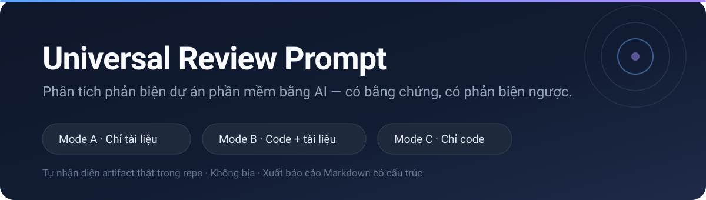
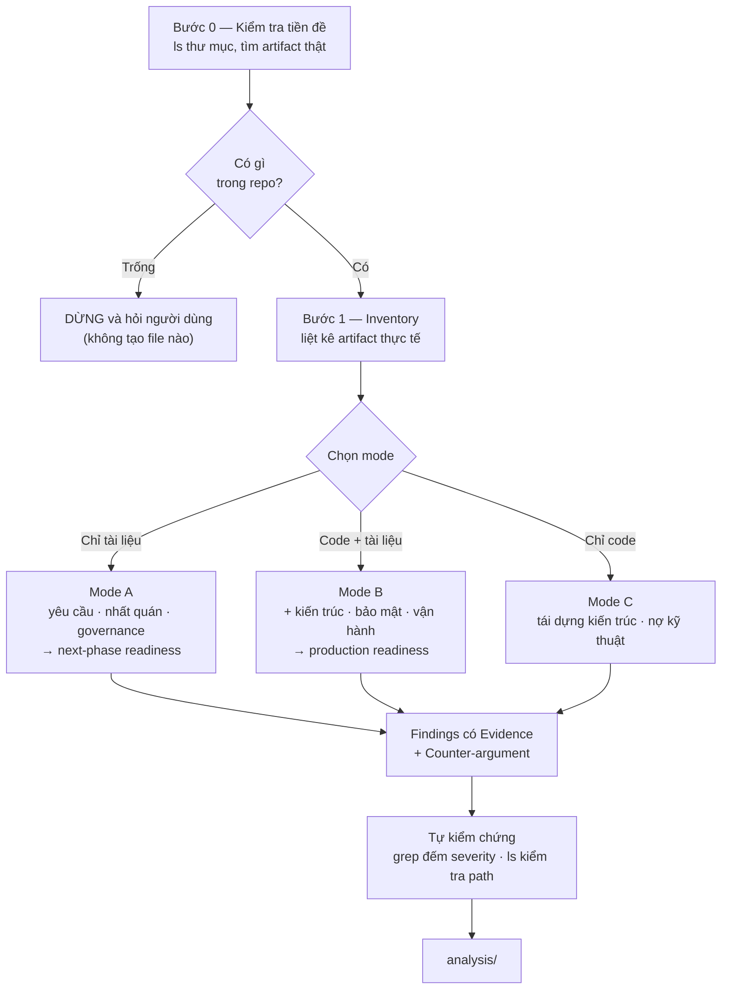

<p align="center">
  
</p>

<p align="center">
  <b>Bảo AI review dự án của bạn — và bắt nó chứng minh từng nhận định.</b><br>
  Tự thích nghi với repo chỉ có tài liệu, chỉ có code, hoặc cả hai.
</p>

<p align="center">
  <a href="#bắt-đầu-trong-30-giây">Bắt đầu</a> ·
  <a href="#nó-tạo-ra-cái-gì">Kết quả mẫu</a> ·
  <a href="#cách-nó-hoạt-động">Cách hoạt động</a> ·
  <a href="#vì-sao-thiết-kế-như-vậy">Thiết kế</a>
</p>

---

## Vấn đề

Bảo AI "review giúp tôi dự án này", bạn thường nhận lại: lời khen chung chung, nhận định không có dẫn chứng, hoặc tệ hơn — kiến trúc **được bịa ra** cho vừa cái khuôn báo cáo.

Prompt này chặn cả ba: bắt kiểm tra cái gì thực sự tồn tại trước, bắt mọi phát hiện phải dẫn được nguồn, và bắt tự phản biện ngược trước khi kết luận.

## Bắt đầu trong 30 giây

**Claude Code** — cài một lần, dùng ở mọi dự án:

```bash
git clone https://github.com/light2a/review-prompts.git
mkdir -p ~/.claude/skills/universal-review
cp review-prompts/skills/universal-review/SKILL.md ~/.claude/skills/universal-review/SKILL.md
```

Mở phiên Claude Code mới, vào thư mục dự án bất kỳ và gõ:

```
/universal-review
```

**AI khác (ChatGPT, Gemini, Cursor…):** dán nội dung [`prompts/universal-harness-review.md`](prompts/universal-harness-review.md) vào đầu hội thoại.

## Nó tạo ra cái gì

Một thư mục `analysis/` có cấu trúc, chỉ gồm những file mà dữ liệu thật cho phép viết:

```
analysis/
├── 00-executive-summary.md      # điểm mạnh, rủi ro, readiness, bảng severity
├── 01-artifact-inventory.md     # cái gì thực sự có trong repo
├── 02-methodology-and-workflow.md
├── 03-findings.md               # phần quan trọng nhất
├── 04-recommendations.md        # P0 / P1 / P2 kèm effort & owner
└── evidence/
```

Mỗi phát hiện theo một khuôn cố định — chú ý mục **Counter-argument**, thứ buộc AI tự cãi lại chính nó trước khi phán:

> ## Finding: Ba capability Must không có chỗ dựa trong kit
> **Severity:** High
>
> **Evidence** — `grep -rin "notification|queue|lifecycle" skills/` → 0 kết quả thuộc domain ứng dụng
>
> **Analysis** — Đây là phần khó nhất của dự án và cũng là nơi race condition sẽ xuất hiện…
>
> **Counter-argument** — Không toolkit quy trình nào phủ nổi domain cụ thể; điều này đúng với mọi kit tương tự.
>
> **Verdict** — ⚠️ Risk accepted nếu đội chủ động bù
>
> **Recommended Fix** — Viết 3 reference file domain trước khi vào Phase 1…

## Cách nó hoạt động



| Mode | Khi nào | Thang đánh giá |
|---|---|---|
| **A** — Chỉ tài liệu | Chưa viết dòng code nào | Sẵn sàng cho phase kế tiếp |
| **B** — Code + tài liệu | Có cả hai | Sẵn sàng production |
| **C** — Chỉ code | Không có BRD/PRD | Sẵn sàng production |

## Vì sao thiết kế như vậy

Ba nguyên tắc lõi, mỗi cái sinh ra từ một lần thất bại thật:

**1. Reality First.** Phiên bản đầu yêu cầu review code trên một repo trống và viện dẫn thư mục không tồn tại — AI làm theo sẽ bịa kiến trúc để có cái mà viết. v3 bắt kiểm tra tiền đề trước, có quy tắc dừng, và biết hỏi khi tài liệu nằm ngoài repo.

**2. Evidence + Counter-argument.** Mọi phát hiện phải dẫn được `file:dòng` hoặc mã yêu cầu, và phải tự trả lời "thiết kế này có thể là lựa chọn có chủ đích không?" trước khi phán ❌.

**3. Tự kiểm chứng bằng lệnh.** Trong lần chạy thử v2, chính bảng tổng hợp severity bị đếm sai và chỉ lộ ra nhờ `grep -c`. Nên v3 đưa bước đếm lại thành bắt buộc.

## Cập nhật & push

```bash
cd review-prompts
git add -A
git commit -m "mô tả thay đổi"
git push
```

Sau khi sửa `skills/universal-review/SKILL.md`, đồng bộ lại bản đã cài (Claude Code đọc từ `~/.claude/skills/`, không đọc trực tiếp repo này):

```bash
cp skills/universal-review/SKILL.md ~/.claude/skills/universal-review/SKILL.md
```

Mở phiên Claude Code mới để nạp lại.

## Changelog

- **v1** — hardcode domain của một dự án khác, yêu cầu đọc thư mục không tồn tại, ép đúng 16 file. Bỏ.
- **v2** — thêm Reality First, 3 mode, file điều kiện, chống hallucination. **Chạy thử thật** trên một repo Mode A → lộ 9 điểm gãy: đè `analysis/` có sẵn, không nhận ra kit đã cài, "production readiness" vô nghĩa khi chưa có code, ép Finding vào file tổng hợp, thiếu quy tắc dừng…
- **v3** — sửa cả 9 điểm gãy, giữ nguyên phần đã chứng minh hoạt động tốt.

## Ghi chú

"Harness" trong tên chỉ **phong cách review có kỷ luật bằng chứng**, lấy cảm hứng từ [harness-skills](https://github.com/Unibean9/harness-skills). Prompt không phụ thuộc repo đó — phần đánh giá kit chỉ chạy khi dự án thực sự có kit.

Prompt viết bằng tiếng Việt; báo cáo đầu ra tự khớp theo ngôn ngữ tài liệu của dự án được review.

## License

[MIT](LICENSE)
